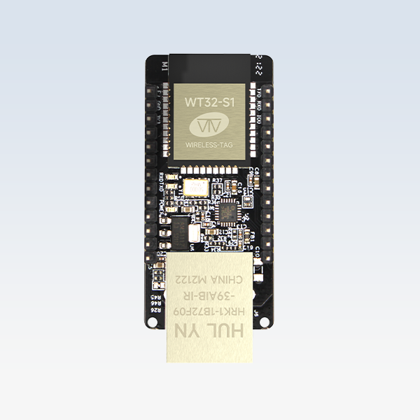

# Unofficial guide to the [WT32-ETH01](http://en.wireless-tag.com/product-item-2.html)



## What is this thing and why would I use it?

The WT32-ETH01 is effectively a small, cheap [ESP32](https://en.wikipedia.org/wiki/ESP32) development board with Ethernet, WiFi, and GPIO pins, made by [a company called "Wireless-Tag" (WT)](http://en.wireless-tag.com/). As of this writing, it's [around $15 at JacobsParts](https://www.jacobsparts.com/items/DEVBOARD-G) and [around $7 from AliExpress](https://www.aliexpress.com/w/wholesale-wt32%2525252deth01.html).

There aren't a ton of ESP32 boards with Ethernet, and the WT32-ETH01 is by far the smallest, cheapest, and simplest. (The [OLIMEX ESP32-POE](https://www.olimex.com/Products/IoT/ESP32/ESP32-POE/open-source-hardware) and [wESP32](https://wesp32.com/) are the other notable options.) So, if you want a cheap-and-cheerful ESP32 board with the reliability of a wired network, the WT32-ETH01 may be a good choice.

It's marketed as a "serial port to Ethernet module" and comes loaded with firmware that lets you send [various "AT" commands](https://core-electronics.com.au/attachments/localcontent/ATCommandsofWT32-ETH01WiredModule_v1_1135593e704.pdf) over 3.3V serial to set up networking, open connections and exchange data. For most of us, it's more interesting to just flash our own programs on the unit and use standard ESP32 networking libraries.

Nobody knows much about [the WT company](http://en.wireless-tag.com/). Don't expect support, and don't lock yourself in too much. Also see [Luberth Dijkman's notes on the part](https://github.com/ldijkman/WT32-ETH01-LAN-8720-RJ45-).

## Pins (and gotchas!)

<table>
  <tr> <td></td>
    <td align="right">EN ⏻</td>
    <td rowspan=13 align="center">WT32-ETH01<br>(ESP32)</td>
    <td>⭕ IO1 (reserved)</td> <td>💬 TXD</td>
  </tr>
  <tr> <td></td> <td align="right">GND ⏚</td> <td>⭕ IO3 (reserved)</td> <td>🗨️ RXD</td> </tr>
  <tr> <td></td> <td align="right">3.3V ⚡</td> <td>⭕ IO0 (reserved)</td> <td>⏱️ REFCLK and 💻 BOOT</td> </tr>
  <tr> <td align="right">pull low to reset</td> <td align="right">EN ⏻</td> <td>⏚ GND</td> <td></td> </tr>
  <tr> <td align="right">ADC1 CH4 📈</td> <td align="right">IO32 ↔️</td> <td>⬅️ IO39 (in only)</td> <td>📈 ADC1 CH3</td> </tr>
  <tr> <td align="right">ADC1 CH5 📈</td> <td align="right">IO33 ↔️</td> <td>⬅️ IO36 (in only)</td> <td>📈 ADC1 CH0</td> </tr>
  <tr> <td></td> <td align="right">IO5 ↔️</td> <td>↔️ IO15</td> <td>📉 ADC2 CH3</td> </tr>
  <tr> <td></td> <td align="right">IO17 ↔️</td> <td>↔️ IO14</td> <td>📉 ADC2 CH6</td> </tr>
  <tr> <td></td> <td align="right">GND ⏚</td> <td>▶️ IO12</td> <td>⚠️ must float at boot</td> </tr>
  <tr> <td></td> <td align="right">3.3V ⚡</td> <td>⬅️ IO35 (in only)</td> <td>📈 ADC1 CH7</td> </tr>
  <tr> <td></td> <td align="right">GND ⏚</td> <td>↔️ IO4</td> <td>📉 ADC2 CH0</td> </tr>
  <tr> <td></td> <td align="right">5V ⚡</td> <td>▶️ IO2</td> <td>⚠️ must float to program</td> </tr>
  <tr> <td align="right">ethernet link light</td> <td align="right">LINK 🖧</td> <td>⏚ GND</td> <td></td> </tr>
</table>

**LEGEND**<br>
⭕ - Not recommended for application use<br>
▶️ - Recommended output only (avoid driving externally)<br>
⬅️ - Input only<br>
↔️ - General purpose I/O<br>
📈 - Analog input on ADC1<br>
📉 - Analog input on ADC2 (conflicts with wi-fi)<br>

Also see [the data sheet](WT32-ETH01_datasheet_V1.3-en.pdf) ([an older version](WT32-ETH01_manual.pdf) has better English), and [pin reference for the ESP32 itself](https://randomnerdtutorials.com/esp32-pinout-reference-gpios/).

Some documents ([like this listing](https://www.amazon.com/dp/B09Z298QJQ)) have pins IO5 and IO35 swapped in comparison to the layout above. All the physical hardware I've seen has the pins laid out as above, but check to make sure!

### Beware!

There are limitations on several of the pins; see "Strapping Pins"
(section 3.3) in the
[processor data sheet](https://www.espressif.com/sites/default/files/documentation/esp32-wroom-32e_esp32-wroom-32ue_datasheet_en.pdf).

**IO0:** At boot, must be pulled low to program, must float or be pulled high
to boot normally. After booting, used to receive the Ethernet 50Mhz clock
(enabled by IO16). Best to avoid any other use.

**IO1:** ESP32 serial output. Used when programming and active by default
when running. Best to avoid any other use.

**IO2:** At boot, must float or be pulled low to program. You can use this pin
(especially for output) but make sure nothing pulls it high while booting.

**IO3:** ESP32 serial input. Used when programming and active by default
when running. Best to avoid any other use.

**IO5, IO15 (MTDO):** At boot, IO5 controls whether ESP32 libraries will print
debug messages to the serial port (IO1). Also at boot, IO5 and IO15 together
control timings of the module that lets the ESP32 act as an SD card.
You are probably not using that module, so you can use these pins (especially
for output) but note the effect on debug chatter if pulled while booting.

**IO12 (MTDI):** At boot, must float or be pulled low or the chip won't work
(wrong voltage). You can use this pin (especially for output) after booting,
but make sure nothing pulls it high while booting.

**IO35, IO36, IO39:** These pins are input only, but are otherwise free to use.

## Physical dimensions and footprint

The WT32-ETH01 board is 60mm x 26mm x 17mm, and weighs 15.4g. (Thanks [Damiano Donati](https://github.com/damdo)!)

By [Dakota Winslow](https://github.com/dakotawinslow/): This repository includes a [KiCad symbol](WT32-ETH01.kicad_sym) and [footprint](WT32-ETH01.pretty).  The symbol is arranged by actual physical pin number (rather than grouped by pin type) to make it easier to design circuits with few overlapping traces. I tried to be as descriptive as possible, but ESP32 pins all have many functions so consult other general ESP32 documentation for additional information about the pins. Note that some of the pin labels differ from what is on the board itself; the marks on the board indicate uses for the built-in firmware, which you will almost certainly replace. I made these from sporadic documentation (most of which is linked to in this repo!) but they have been tested in my own projects so I have some confidence. Obviously they are provided with no warranty. Caveat emptor.

## Power

You may supply 3.3V power on the `3V3` pins, or 5V power on the `5V` pins, but not both at once!

The schematic lists an "LM1117F-1.8V" voltage regulator, which is clearly wrong-- the output is 3.3V, not 1.8V, and also the actual part on the board is marked "AMS1117-3.3". If this were a [true AMS1117](http://www.advanced-monolithic.com/pdf/ds1117.pdf) it would have a max input of 15V and thermal protection, but it doesn't actually seem to have either; with 12V input, many WT32-ETH01 parts will generate smoke. Probably it's a [low-spec AMS1117 knock-off](https://goughlui.com/2021/03/27/note-linear-regulator-woes-when-is-an-ams1117-not-an-ams1117/) of some kind. So, I'd limit its input to 6V or so, or use your own 3.3V source if you need to.

The WT32-ETH01 does not support Power over Ethernet (PoE), you'll need an external "splitter" if you want that.

### Power-on reset

The WT32-S1 module (silver box) includes an R-C circuit on EN with 10KΩ × 0.1µF = 1msec time constant. The WT32-ETH01 board includes a separate R-C circuit for the LAN8720A Ethernet controller, also with 1msec time constant. These are quite fast, so if input voltage ramps slowly, the chip may not start reliably, [as discussed in this thread](https://wled.discourse.group/t/wt32-eth01-hangs-on-boot-after-psu-power-up/2937/5).

This can be fixed if necessary by adding another capacitor (e.g. 10µF for 100msec of reset delay), a proper reset supervisor, or a power supply/regulator with a `PGOOD` (or `/RESET`) signal you can tie to `EN`.

## Programming

Astute readers will have noticed this part has no USB port, so you need an adapter of some kind. There are several possibilities, listed below; whichever one you use, [PlatformIO's WT32-ETH01 board support](https://docs.platformio.org/en/latest/boards/espressif32/wt32-eth01.html) or the [Arduino IDE ESP32 add-on](https://espressif-docs.readthedocs-hosted.com/projects/arduino-esp32/en/latest/installing.html) (selecting `ESP32 Dev Board`) should work for programming, or you can use [esptool.py](https://github.com/espressif/esptool) directly if you're hardcore. (I'm not that hardcore.)

### Programming with a downloader gizmo

The most convenient programming solution is a gizmo like [M5Stack's ESP32 Downloader](https://shop.m5stack.com/products/esp32-downloader-kit) (I use this) or [wESP32-Prog](https://wesp32.com/wesp32-prog/) (untested, but ought to work). These products include a USB-serial adapter and an automatic bootloading circuit. They have 6 pins (in different orders, sadly) that connect to the 6 "programming" pins at the top (WiFi antenna end) of the WT32-ETH01, at which point programming should work. When I design carrier boards for the WT32-ETH01, I route those 6 pins to a 6-pin header laid out for the programmer. If you're working with a raw board, you can use [jumper wires like these](https://www.adafruit.com/product/1950).

When wiring up the gizmo, make sure gizmo RX goes to WT32-ETH01 TX and vice versa. Also mind the power connections; the M5Stack programmer has a 3.3V output, the wESP32-Prog has a 5V output, make sure you use the right power pin if you want the programmer to power the board. (The 5V input isn't actually in the top 6 "programming pins", but it is labeled.)

### Programming with a USB-serial adapter

You can also program the WT32-ETH01 with a regular USB-serial adapter, but it is a bit tricky:

- You need a 3.3V TTL adapter, not 5V (and certainly not RS-232!)
- To load code, the ESP32 needs [the IO0 (BOOT) pin grounded while toggling EN](https://docs.espressif.com/projects/esptool/en/latest/esp32/advanced-topics/boot-mode-selection.html)
- You can [manually connect those pins to ground](https://docs.espressif.com/projects/esptool/en/latest/esp32/advanced-topics/boot-mode-selection.html#manual-bootloader) (with wires, or buttons) but this gets old fast
- Or, use [automatic DTR/RTS bootloading](https://docs.espressif.com/projects/esptool/en/latest/esp32/advanced-topics/boot-mode-selection.html#automatic-bootloader), which needs this mini circuit (credit [cyberboy666](https://github.com/egnor/wt32-eth01/issues/3))


When wiring up a serial adapter, make sure adapter RX goes to WT32-ETH01 TX and vice versa. You will also need to power the WT32-ETH01 somehow, of course.

### Programming with an old Arduino

If you don't have a downloader gizmo or serial adapter, but do have an Arduino Uno or similar with onboard USB-serial, you can use that (credit [comporder1](https://github.com/egnor/wt32-eth01/issues/4)). Remove the Arduino microcontroller IC, then use four wires to link 3v3, GND, TX, and RX between the Arduino and WT32-ETH01. (Do NOT cross TX/RX with this method.) You will need to [manually connect IO0 (BOOT) to ground](https://docs.espressif.com/projects/esptool/en/latest/esp32/advanced-topics/boot-mode-selection.html#manual-bootloader) while powering on the WT32-ETH01 to put it in bootloader mode, but then programming should work.

## Using Ethernet

WiFi is internal to the ESP32 and works "out of the box", but wired Ethernet takes a bit of configuration for the WT32-ETH01:
- The interface to the Ethernet PHY uses GPIO 23 for MDC and GPIO 18 for MDIO
- There's an external oscillator that drives pin 0
- That oscillator is enabled by setting GPIO 16 high
- The PHY reset pin is NOT wired to a GPIO (it gets reset at startup)

### Using the ESP32-Arduino "ETH" library

The [`ETH` library](https://espressif-docs.readthedocs-hosted.com/projects/arduino-esp32/en/latest/api/ethernet.html)  that comes with the ESP32 Arduino runtime should work if started like this:

```
ETH.begin(ETH_PHY_LAN8720, 1, 23, 18, 16, ETH_CLOCK_GPIO17_OUT);
```

(Note that pin 16 is being configured as PHY reset, even though it's not actually the reset pin, this will cause the library code to set it high which is needed to enable the oscillator.) This will initialize the [ESP-IDF lwIP subsystem](https://docs.espressif.com/projects/esp-idf/en/stable/esp32/api-guides/lwip.html), and most Arduino networking code should work.

### Using ESP-IDF with Ethernet

If you're not using the Arduino runtime, or don't like the `ETH` library, or want finer control, you can use [ESP-IDF](https://idf.espressif.com/) interfaces directly. As above, this will initialize lwIP, so again most networking code should work.

```
#include <esp_netif.h>
#include <esp_netif_types.h>

...

// https://esphome.io/components/ethernet.html
ESP_LOGD(TAG, "Initializing Ethernet MAC for WirelessTag WT32-ETH01...");
eth_mac_config_t mac_config = ETH_MAC_DEFAULT_CONFIG();
mac_config.clock_config.rmii.clock_mode = EMAC_CLK_EXT_IN;
mac_config.clock_config.rmii.clock_gpio = EMAC_CLK_IN_GPIO;
mac_config.smi_mdc_gpio_num = 23;
mac_config.smi_mdio_gpio_num = 18;
mac_config.sw_reset_timeout_ms = 1000;  // from ETH.cpp
mac = esp_eth_mac_new_esp32(&mac_config);

ESP_LOGD(TAG, "Initializing Ethernet PHY (LAN8720A) for WT32-ETH01...");
eth_phy_config_t phy_config = ETH_PHY_DEFAULT_CONFIG();
phy_config.phy_addr = 1;
phy_config.reset_gpio_num = -1;
phy = esp_eth_phy_new_lan87xx(&phy_config);

// Enable external oscillator (pulled down at boot to allow IO0 strapping)
ESP_ERROR_CHECK(gpio_set_direction(GPIO_NUM_16, GPIO_MODE_OUTPUT));
ESP_ERROR_CHECK(gpio_set_level(GPIO_NUM_16, 1));
ESP_LOGD(TAG, "Starting Ethernet interface...");

// Install and start Ethernet driver
esp_eth_config_t eth_config = ETH_DEFAULT_CONFIG(mac, phy);
esp_eth_handle_t eth_handle = nullptr;
ESP_ERROR_CHECK(esp_eth_driver_install(&eth_config, &eth_handle));

esp_netif_config_t const netif_config = ESP_NETIF_DEFAULT_ETH();
global_netif = esp_netif_new(&netif_config);
auto const eth_netif_glue = esp_eth_new_netif_glue(eth_handle);
ESP_ERROR_CHECK(esp_netif_attach(global_netif, eth_netif_glue));
ESP_ERROR_CHECK(esp_eth_start(eth_handle));
```

### Using Rust / esp-idf-svc

If you're so inclined, it's also quite easy to use ESP-IDF from rust:

```rust
let sysloop = esp_idf_svc::EspSystemEventLoop::take()?; // Or already have this handle

let clock = esp_idf_svc::eth::RmiiClockConfig::<gpio::Gpio0, gpio::Gpio16, gpio::Gpio17>::Input(
    pins.gpio0,
);
let eth_driver = esp_idf_svc::eth::EthDriver::new_rmii(
    peripherals.mac,
    pins.gpio25, // rxd0
    pins.gpio26, // rxd1
    pins.gpio27, // crs dv
    pins.gpio23, // mdc
    pins.gpio22, // txd1
    pins.gpio21, // tx en
    pins.gpio19, // txd0
    pins.gpio18, // mdio
    clock,
    Some(pins.gpio16), // nRST isn't connected per the datasheet, but per the above
    comment we set it to 16.
    esp_idf_svc::eth::RmiiEthChipset::LAN87XX,
    Some(1), // phy addr
    sysloop.clone(),
)?;
let eth = esp_idf_svc::eth::EspEth::wrap(eth_driver)?;
let mut eth = esp_idf_svc::eth::BlockingEth::wrap(eth, sysloop.clone())?;

eth.start()?;
```

### Using ESPHome with Ethernet

If you're using [ESPHome firmware](https://esphome.io/), you can configure it to use WT32-ETH01
You'll want to add this to the [device configuration](https://esphome.io/components/ethernet.html):

```
ethernet:
  type: LAN8720
  mdc_pin: GPIO23
  mdio_pin: GPIO18
  clk_mode: GPIO0_IN
  phy_addr: 1
  power_pin: GPIO16
```

### Using Tasmota with Ethernet

If you're using [Tasmota firmware](https://tasmota.github.io/docs/), use
[the WT32-ETH01 configuration](https://tasmota.github.io/docs/ESP32-Devices/#wt32-eth01)
as documented.

## Internal details

[The data sheet](WT32-ETH01_datasheet_V1.3-en.pdf) gives a pretty good overview of the product, including a system block diagram:


- [LAN8720A](https://www.microchip.com/en-us/product/LAN8720A) is the Ethernet physical layer controller (PHY)
- [WT32-S1](https://www.lcsc.com/product-detail/WIFI-Modules_Wireless-tag-WT32-S1_C477832.html) is WT's ESP32 module (metal box), a (discontinued?) [ESP32-WROOM-32E-N4](https://www.espressif.com/sites/default/files/documentation/esp32-wroom-32e_esp32-wroom-32ue_datasheet_en.pdf) clone based on the same [ESP32-D0WD-V3](https://www.espressif.com/sites/default/files/documentation/esp32_datasheet_en.pdf) chip, with 4MB (32Mb) of flash (no PSRAM)
- "Left Interface" and "Right Interface" are just the two pin headers
- "烧录接口" means "programming interface" (the six topmost pins)

There are multiple revisions of the device -- I've seen "V1.2" and "V1.4" on the silkscreen, and the trace routing does differ -- but the differences are unknown. You can get it with or without pin headers pre-soldered on.

Finally, there's a [schematic floating around](WT32_ETH01_V2.schematic.pdf). Its provenance and accuracy are unknown, but it's been helpful to me.

## TODO

- Post KiCad files for ~footprints~, breakout boards, and programming connectors
- Discussion of issues reported elsewhere?
